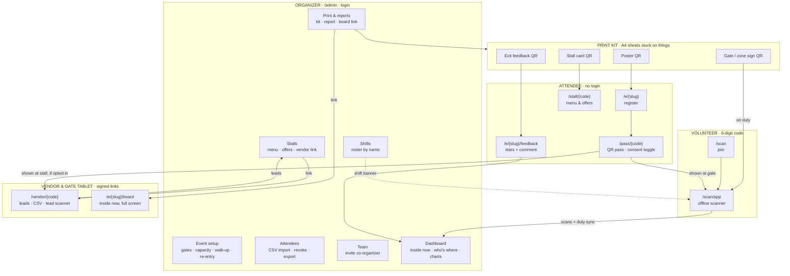
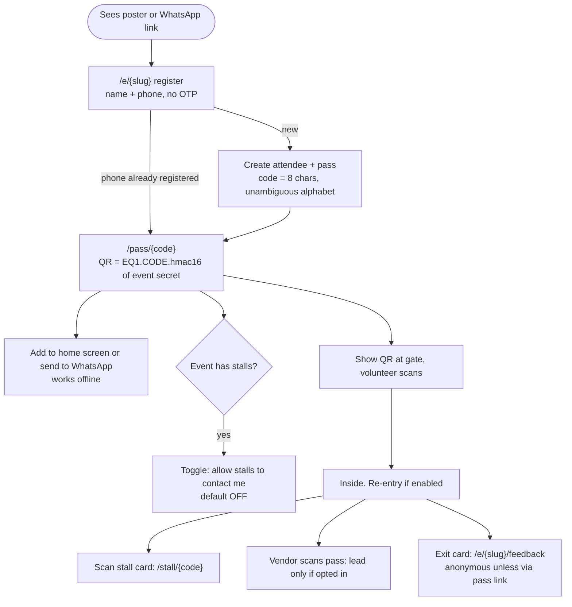
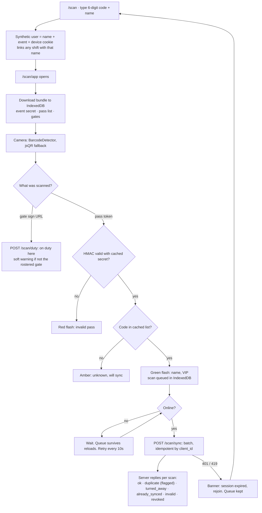
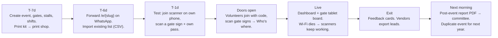
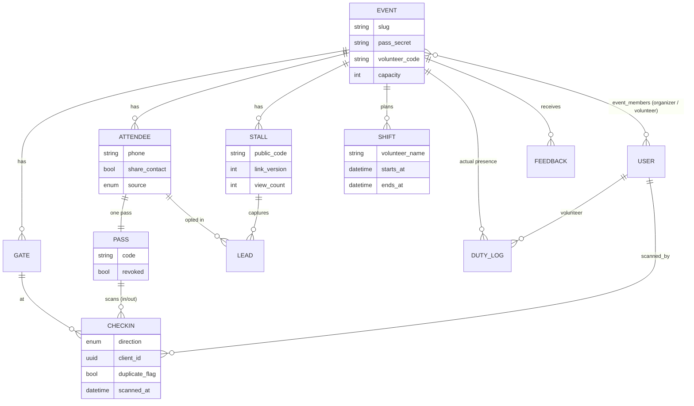

# Gatezo — how it all fits together

Four audiences, one Laravel app. Every printed QR is a URL into one of these flows.
Rendered PNGs live in `docs/flows/`:

| File | What |
|---|---|
| `1-system-map.png` | Five lanes (organizer, print kit, attendee, volunteer, vendor/tablet) and every handoff between them |
| `2-attendee.png` | Register → pass → gate → stalls → feedback |
| `3-volunteer.png` | Join → offline scanner → sync, including the failure branches |
| `4-event-day.png` | T-7 days to next morning |
| `5-data-model.png` | Tables and what each printed QR points at |

Re-render: open the HTML for the map; for the Mermaid ones paste a block into https://mermaid.live or any Markdown viewer.

## 1. System map: who touches what

Hand-laid swimlane in `docs/flows/system-map.html` (open in a browser, or see `docs/flows/1-system-map.png`).
The Mermaid version below is the same information for tools that render Markdown.

## 2. Attendee journey

## 3. Volunteer journey (the offline part)

## 4. Event day timeline

## 5. Data model (what each QR points at)

